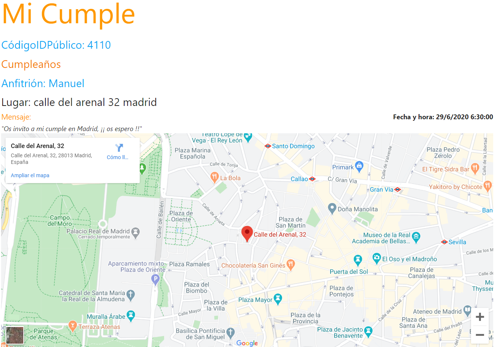

# Web App of EasyEvents

EasyEvents is an App that can be used to easily create events and share the event info with the invitees via a unique Event Code. 
 
The project is divided int 3 repositories: 
-Back-End API : https://github.com/andressanzr/EasyEvents-Back 
-Web App : this repo 
-Android App: https://github.com/andressanzr/EasyEvents-Android 

# App screenshot

# Steps to run the App

Make sure that the API is already running otherwise the App functionality won´t work.

### `npm start`

Runs the app in the development mode. 
Open [http://localhost:3000](http://localhost:3000) to view it in the browser.
